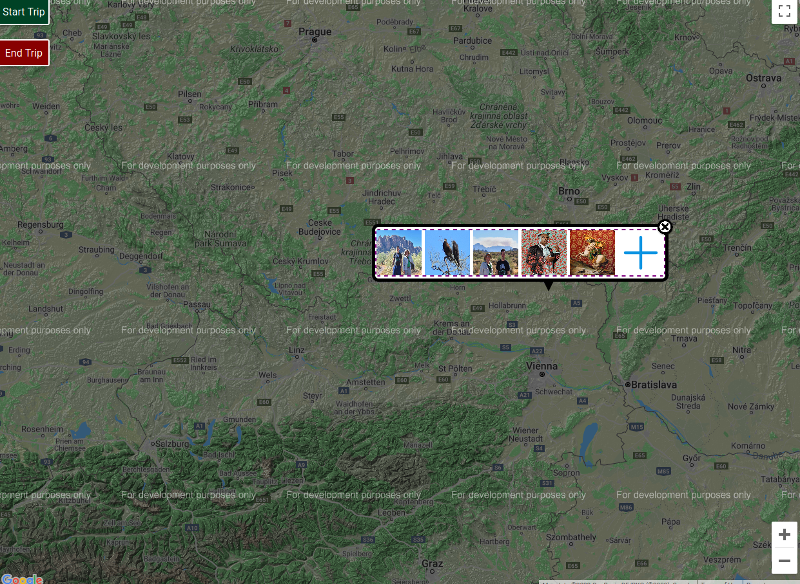
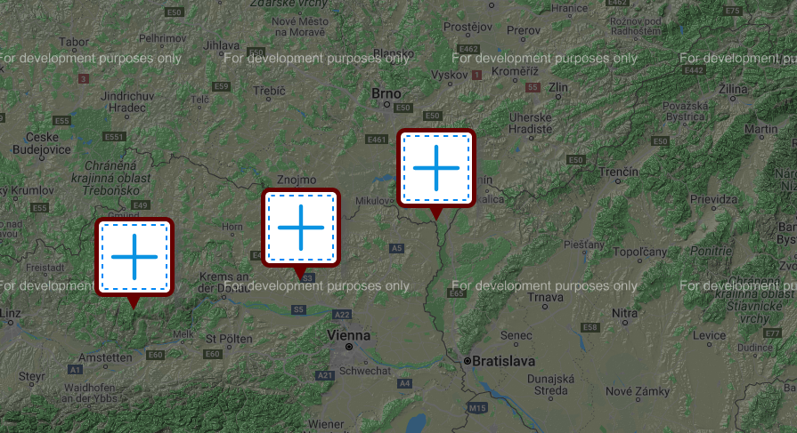

# Tellem

Google Maps expanded.

A privacy focused application meant to be hosted locally, and all media stored locally. Could be used to document completed trips, plan trips, or even show local variations (for instance, accents) on a google map.

Quickly add photos, videos, notes, songs, etc. to a plotted trip or map.

## Made with [HTML5 Boilerplate](https://html5boilerplate.com/)

Requires:

- Python3 (with pip packages flask, flask_cors, werkzeug, and sqlite3)
- A modern Browser (updated Chrome or Firefox will work)

The code is available under the [MIT license](LICENSE.txt).
